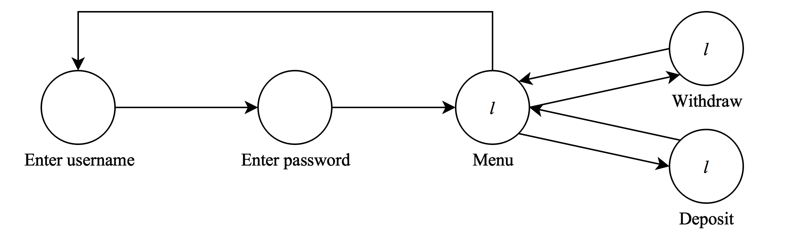

# Modellering

Vi har valt att modellera en bankomat, där man kan logga in med användarnamn och lösenord, för att sedan antingen ta ut eller sätta in pengar. Det finns bara en atom, *l*, som står för "logged in".



## Specificering (systemegenskaper)

Starttillståndet för båda egenskaper nedan är *Enter username*.

### Sann: $EF(EG(l))$

Det existerar en path där ifrån något framtida tillstånd (till exempel "menu") det existerar en path där alltid *l*.

Denna formel formaliserar systemegenskapen att när man loggat in på bankomaten kan man utföra hur många ärenden (sätta in/ta ut pengar) som helst, utan att bli utloggad. Det finns ingen tidsgräns.

### Falsk: $EG(l))$

Det finns ingen path där alltid *l*.

Denna formel formaliserar systemegenskapen att man inte från starttillståndet kan gå direkt till att vara inloggad utan att skriva in ett giltigt användarnamn och lösenord.

# Predikattabell

### `check(T, L, S, U, F)`

Detta predikat är sant om *formeln* `F` stämmer för modellen som definieras av *transitions* `T` (övergångar) och *labels* `L` (atomer), från *starttillståndet* `S`. `U` är en lista av tidigare besökta tillstånd, vilken vi behöver för att kunna avbryta exekveringen då vi når en "loopande" path i vår modell.

### `elements(L, S, SElements)`

Detta predikat är sant om `SElements` är listan av övergångar/atomer som "tillhör" tillståndet `S` i listan av listor med övergångar/atomer `L`.

### `adjacent(T, A, B)`

Detta predikat utnyttjar `elements` för att plocka ut ett element i taget ur en lista av övergångar `T`. Formellt sett är predikatet sant om `B` är ett element i listan av övergångar/atomer som tillhör tillståndet `S` i listan av listor med övergångar/atomer `T`, men vi använder bara `adjacent` för övergångar.

\newpage

# Appendix

## Programkod

```prolog
% Load model, initial state and formula from file.
verify(Input) :-
    see(Input), read(T), read(L), read(S), read(F), seen,
    check(T, L, S, [], F).

verify(Input, F) :-
    see(Input), read(T), read(L), read(S), seen,
    check(T, L, S, [], F).

% check(T, L, S, U, F)
%   T - The transitions in form of adjacency lists
%   L - The labeling
%   S - Current state
%	U - Currently recorded states
%	F - CTL Formula to check.

% Should evaluate to true iff the sequent below is valid.
% (T,L), S |- F
%		   U

% Om atom: kolla att F stämmer i S
check(_, L, S, _, F) :-
	elements(L, S, SElements),
	member(F, SElements), !.

% Om atom: kolla att neg(F) stämmer i S
check(_, L, S, _, neg(F)) :-
	elements(L, S, SElements),
	not(member(F,SElements)), !.

% And: Kolla att F och G stämmer i S
check(T, L, S, _, and(F,G)) :-
	check(T, L, S, [], F),
	check(T, L, S, [], G).

% Or: Kolla att F eller G stämmer i S
check(T, L, S, _, or(F,G)) :-
	check(T, L, S, [], F), !;
	check(T, L, S, [], G), !.

% AX: "F gäller i alla angränsande tillstånd"
check(T, L, S, U, ax(F)) :-
	adjacent(T, S, SAdjacent),
	not(check(T, L, SAdjacent, U, F)), !, fail.

% Om programmet kommer hit betyder det att alla grannar till S har behandlats i
% ovanstående sats utan att faila.
check(_, _, _, _, ax(_)).

% EX: "I något nästa tillstånd gäller F"
check(T, L, S, _, ex(F)) :-
	adjacent(T, S, SAdjacent),
    check(T, L, SAdjacent, [], F), !.

% AG: "Alltid F för alla vägar"
check(_, _, S, U, ag(_)) :-
	member(S,U). % Klar om slinga är nådd

check(T, L, S, U, ag(F)) :-
	check(T, L, S, [], F), % Kolla att F för detta tillstånd
	check(T, L, S, [S|U], ax(ag(F))). % Kolla att F för angränsande tillstånd

% EG: "Det finns en väg där alltid F"
% Om vi kommer till ett tillstånd där vi redan varit ska vi avbryta denna path.
check(_, _, S, U, eg(_)) :- 
	member(S, U), !. 

check(T, L, S, U, eg(F)) :-
    % Kolla formeln F för det aktuella tillståndet S
    check(T, L, S, [], F),
    % Hämta ut alla angränsande tillstånd
    adjacent(T, S, SAdjacent),
    % Lägg till det aktuella tillståndet till listan över besökta tillstånd
    % U, och undersök angränsande tillstånd
    check(T, L, SAdjacent, [S|U], eg(F)).

% AF: "Så småningom F för alla vägar"
check(T, L, S, U, af(F)) :- 
	not(member(S, U)),
	check(T, L, S, [], F).

check(T, L, S, U, af(F)) :-
	not(member(S, U)),
	check(T, L, S, [S|U], ax(af(F))).

% EF: "Det finns en väg där så småningom F"
check(T, L, S, U, ef(F)) :- 
	not(member(S, U)),
	check(T, L, S, [], F).

check(T, L, S, U, ef(F)) :-
	not(member(S, U)),
	adjacent(T, S, SAdjacent),
	check(T, L, SAdjacent, [S|U], ef(F)).

% ---- HELP PREDICATES ----------------
% adjacent(T, A, B) är sant om det finns en övergång i "databasen" T från A till B.
adjacent(T, S, B) :-
	elements(T, S, Adjacents),
	member(B, Adjacents).

% Sant om SElements tillhör S för en lista med övergångar eller labels.
elements([HElements|_], S, SElements) :-
	[S, SElements] = HElements.
elements([_|TElements], S, SElements) :-
	elements(TElements, S, SElements).
```

\newpage

## Exempelmodell

```prolog
% Angränsande tillstånd, modell M
[
    [enter_username, [enter_password]],
    [enter_password, [menu]],
    [menu, [enter_username, withdraw, deposit]],
    [withdraw, [menu]],
    [deposit, [menu]]
].

% Egenskaper för tillstånd, modell M
[
    [enter_username, []],
    [enter_password, []],
    [menu, [l]],
    [withdraw, [l]],
    [deposit, [l]]
].

% Starttillstånd
enter_username.

% Formel att kolla
ef(eg(l)). 		% Sann
% eg(l).		% Falsk
```
